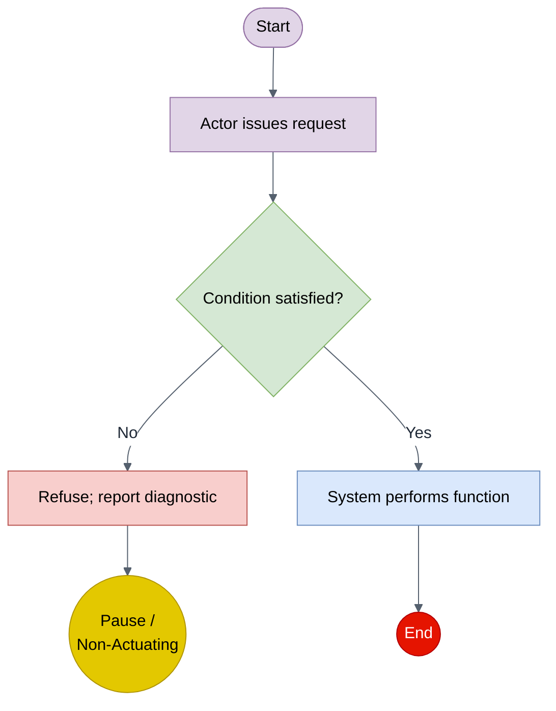

# Skill: architecture

Create or update an architecture diagram artifact in `system/architecture/<feature>/`.

Architecture diagrams use Mermaid syntax inside a fenced ` ```mermaid ` block, paired with a plain Markdown table describing the diagram's purpose, scope, and notes. One diagram per file, so each file maps to a single reviewable unit.

This skill is also the **single source for this repo's Mermaid conventions** (§Mermaid conventions below) — the dark-mode directive, color scheme, shape conventions, and gotchas apply to *all* Mermaid diagrams in the repo, including optional `## Flow Diagram` blocks in use-case files.

## Create flow

Ask the user for:

- Diagram title (short description for the filename)
- Diagram type — `component`, `sequence`, `state`, `deployment`, or `use-case`
- Parent product requirement filename (e.g. `req-geofence-alert-latency.md`) — **required**
- A brief description of what the diagram shows (purpose and scope)

Every architecture diagram must trace to a product requirement (sibling to system requirements under the same parent, not nested under one). If the user does not yet have a parent product requirement, stop and direct them to author one with `/product-requirement` first.

Locate the parent product requirement under `product/requirements/`. The feature bucket is the directory the parent lives in — reuse it for the new diagram. If the parent cannot be located, ask the user for the correct filename rather than guessing a bucket.

Then:

1. Create `system/architecture/<feature>/arch-<short-description>.md` from `templates/architecture-diagram.md`. Create the feature directory if it doesn't exist.
2. Populate YAML frontmatter:
   - `id`: filename without the `.md` extension
   - `title`: human-readable title
   - `parent-product-requirement`: parent filename including `.md`, no directory path — required
   - `diagram-type`: as provided
3. Fill the plain Markdown table rows:
   - **Purpose** — one sentence on why the diagram exists
   - **Scope** — what is in/out of scope
   - **Notes** — assumptions, open questions, or references; `TBD` if none
4. Write the Mermaid source inside the fenced ` ```mermaid ` block, following the Mermaid conventions below (start with the dark-mode init directive). If the user has not provided diagram content yet, leave a stub like `%% TODO: fill in diagram` inside the block and note it in the Notes row.
5. Update `traceability/TRACEABILITY.md`: fill the Architecture cell on the row containing the parent product requirement. Link relative to `traceability/`: `[arch-<name>.md](../system/architecture/<feature>/arch-<name>.md)`. If a product requirement has multiple supporting diagrams, duplicate the row.

Finish by running `python tools/validate.py` from the repo root and fixing anything it reports (it requires at least one fenced ` ```mermaid ` block in every `arch-*.md`).

## Update flow

If the diagram already exists:

1. Locate it under `system/architecture/` and read it
2. Ask the user what needs to change (Mermaid source, purpose/scope/notes, parent, type)
3. Apply only the requested changes — do not regenerate the whole file
4. Re-run `python tools/validate.py`

## Conventions

- Filename: `arch-<short-description>.md` in kebab-case
- Tables are plain Markdown, never HTML `<table>` markup
- Examples: `arch-geofence-alert-flow.md`, `arch-dock-return-flow.md`, `arch-safety-stop-state-machine.md`

---

## Mermaid conventions

Applies to every Mermaid diagram in this repo (architecture diagrams and optional use-case `## Flow Diagram` blocks).

### Diagram type → declaration

| Diagram type | Mermaid declaration |
|---|---|
| component | `flowchart TD` or `graph LR` |
| sequence | `sequenceDiagram` |
| state | `stateDiagram-v2` |
| deployment | `flowchart` with subgraphs for nodes |
| use-case | `flowchart TD` |

### 1. Dark-mode handling (required on every diagram)

Markdown hosts (GitHub dark, VS Code preview) apply their own dark Mermaid theme and mangle hardcoded colors. Pin the theme and palette with a per-diagram init directive so the host cannot override it; the diagram then renders as a consistent light-on-any-background diagram (every label sits inside a light-filled shape), readable in dark mode.

Place this as the FIRST line inside the ` ```mermaid ` block, before `flowchart` / `stateDiagram-v2` / `sequenceDiagram`:

```text
%%{init: {"theme":"base","themeVariables":{"background":"#ffffff","primaryColor":"#dae8fc","primaryTextColor":"#1f2937","primaryBorderColor":"#6c8ebf","lineColor":"#55606e","secondaryColor":"#d5e8d4","tertiaryColor":"#f3f4f6","clusterBkg":"#f3f4f6","clusterBorder":"#9aa5b1","edgeLabelBackground":"#ffffff","textColor":"#1f2937","noteBkgColor":"#fff3c4","noteTextColor":"#1f2937","noteBorderColor":"#d6b656","actorBkg":"#dae8fc","actorBorder":"#6c8ebf","actorTextColor":"#1f2937","signalColor":"#55606e","signalTextColor":"#1f2937","labelBoxBkgColor":"#dae8fc","labelBoxBorderColor":"#6c8ebf","labelTextColor":"#1f2937","loopTextColor":"#1f2937","sequenceNumberColor":"#ffffff"}}}%%
```

- A per-diagram `%%{init}%%` overrides the global config, including any host theme.
- The JSON must be valid (double-quoted keys/values); keep it on one line.
- This pins **light** rendering everywhere (the portable, robust choice). A static `.md` diagram cannot flip to a dark palette based on the viewer's mode, so consistent-light is intended.
- Edge case: a **sequence** diagram's floating message text relies on the diagram background; it reads fine with this palette, but is the element most sensitive on a dark host that ignores the background hint.

### 2. Default color scheme (flowchart node classes)

For flowchart-style diagrams (use-case flow diagrams, component diagrams) use these six node classes; tag nodes with `:::class`. Light pastel fills with black text (white text on the red `stop` node) so nodes stay readable on any background.

| Class | Meaning | classDef |
|---|---|---|
| `actor` | External actor / trigger (operator, external system, Start) | `fill:#e1d5e7,stroke:#9673a6,color:#000` (purple) |
| `function` | A system function / processing step | `fill:#dae8fc,stroke:#6c8ebf,color:#000` (blue) |
| `gate` | Decision / condition check | `fill:#d5e8d4,stroke:#82b366,color:#000` (green) |
| `fail` | Failure / refusal / safe-stop branch | `fill:#f8cecc,stroke:#b85450,color:#000` (red-pink) |
| `pause` | Pause / escalation / non-actuating terminal | `fill:#e3c800,stroke:#B09500,color:#000` (amber) |
| `stop` | Terminal end / completion | `fill:#e51400,stroke:#B20000,color:#fff` (red, white text) |

Copy-paste classDef block (append at the end of the diagram):

```text
    classDef actor fill:#e1d5e7,stroke:#9673a6,color:#000
    classDef function fill:#dae8fc,stroke:#6c8ebf,color:#000
    classDef gate fill:#d5e8d4,stroke:#82b366,color:#000
    classDef fail fill:#f8cecc,stroke:#b85450,color:#000
    classDef pause fill:#e3c800,stroke:#B09500,color:#000
    classDef stop fill:#e51400,stroke:#B20000,color:#fff
```

The init palette (§1) and these `classDef` colors are aligned, so classed and un-classed elements look consistent.

### 3. Node-shape conventions

- `id([Start])` — stadium for Start / actor entry.
- `id["Label"]` — rectangle for functions/steps (`:::function`, `:::actor`, `:::fail`).
- `id{Label?}` — diamond for gates. Quote the label if it contains parentheses: `id{"Label (parens)?"}`.
- `id(("Label"))` — double circle for terminals (`:::pause`, `:::stop`).

### 4. Syntax gotchas

- Bare `&` in a label must be `&amp;` (parser treats `&` as an entity start).
- Parentheses inside a diamond `{...}` label require the label double-quoted: `gate{"value (mm)?"}`.
- HTML entities render: `&amp;`, `&laquo;` `&raquo;` (for &laquo;include&raquo;), `&mdash;`, `&hellip;`, `&rarr;`, `&plusmn;`. Prefer entities over raw glyphs.
- Use `<br/>` for line breaks inside labels.
- Do not name a node `end` (lowercase) — reserved in flowcharts.

### 5. Full example (flowchart)


