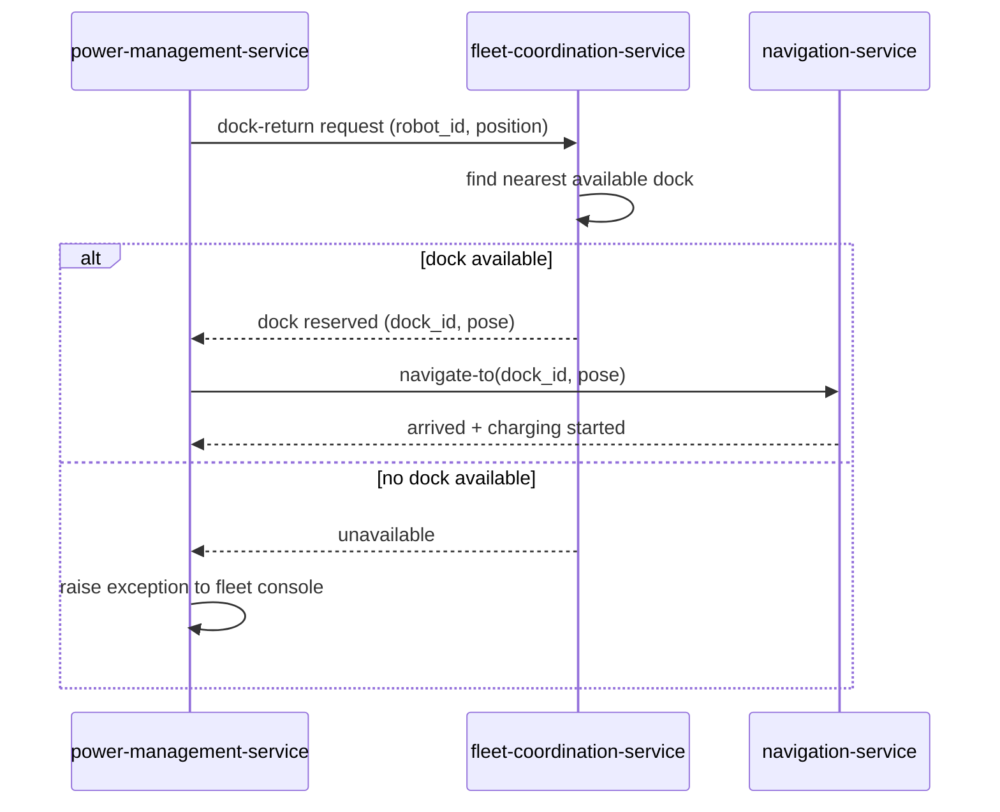

| Field | Value |
|---|---|
| Purpose | Show the sequence of calls from battery-threshold detection through dock reservation to navigation start |
| Scope | low-battery-return-to-dock feature |
| Notes | Dock reservation is centralized in fleet-coordination-service per `adr-0001-centralize-dock-reservation-in-fleet-service.md` |

