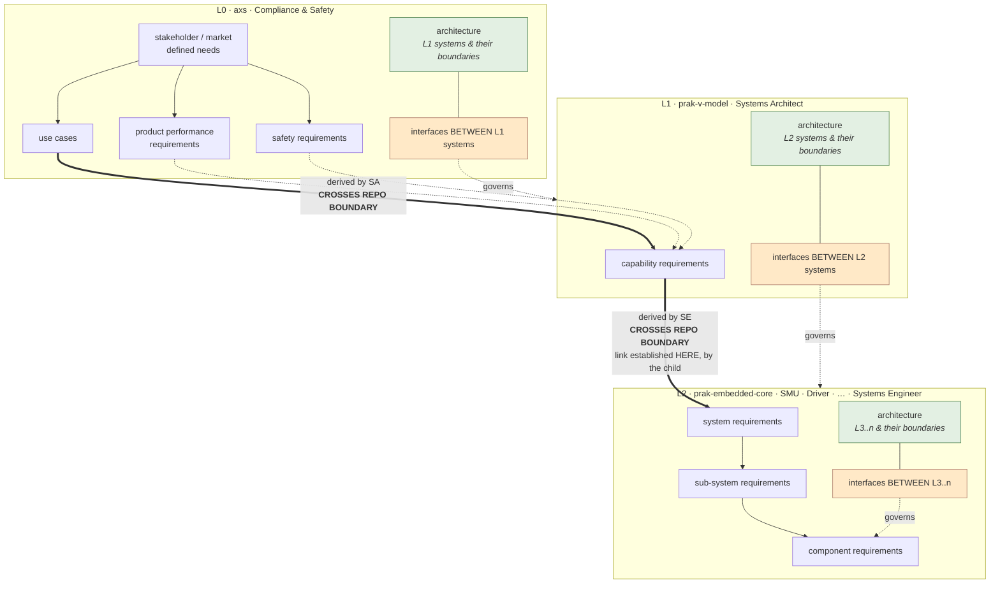

# Tier Schema

**Status:** Normative for this standard
**Agreed:** 2026-09-11 (Patrick McKee, SE). Ben Miller concurred on the reading
that system requirements sit below L1; the Systems Architect's confirmation is
outstanding.
**Supersedes:** the "hinge" model in `ASI-Systems-Standard-Decision-Record-v1.md`
§5, which placed system requirements at both L1 and L2.

This is the single normative statement of levels, tiers, ownership and interface
authority. Every other file in this repo references it rather than restating it.
If something here is wrong, fix it **here** and let the references follow.

---

## 0. The architecture, in one diagram

No prior diagram depicts this. The SA's `Common-system-decomposition-diagram`
(v4, 2026-09-09) contains zero occurrences of "PRAK", uses the predecessor term
VAK, is marked work-in-progress, and carries three competing level schemes
(review items `G1`, `G3`, `G9`). This is the agreed architecture as ratified in
`decisions.md` D-01 … D-04.



**Read the diagram as three statements:**

1. **Requirements flow down, one level at a time.** Each level derives its
   artifacts from the level above. Nothing skips a level.
2. **Every level-to-level link crosses a repository boundary** (the double
   arrows) — L0→L1 as much as L1→L2, because each level is its own repo. Both
   need upstream enforcement (`tools/broker.py`).
3. **Links are established by the child, looking up.** An L2 system requirement
   names the L1 capability requirement it derives from; L1 does not reach down to
   claim it. The parent level therefore *observes coverage* rather than creating
   links — which is why enforcement is upstream and coverage reporting is a
   separate, later problem.
4. **Interface ownership sits one level above what it governs** (orange), and
   **every level carries architecture** (green) for the same reason: a boundary
   between two entities cannot be defined without an architecture that says those
   entities exist and how they relate. Architecture and interfaces are the same
   responsibility seen from two sides, which is why they appear paired at every
   level including L0.

### Why interface ownership sits above

Two peers cannot arbitrate a boundary they both sit on — neither has standing to
bind the other, so a conflict has no venue. The integrating level has both the
system view and the authority.

The stronger reason is schedule: **the interface must be fixed before either side
can be developed or verified independently.** An undefined boundary serialises
work that should run in parallel.

---

## 1. Levels

A **level** is a position in the architecture chain. **One repository is one
level.** Levels are not stored on artifacts — they are a property of the repo,
declared once in `repo-standard.yaml`.

| Level | Repo (example) | Owner | Derives its artifacts from |
|-------|---------------|-------|----------------------------|
| **L0** | `axs` | Compliance & Safety | Stakeholder and market defined needs |
| **L1** | `prak-v-model` | Systems Architect | L0 artifacts |
| **L2** | `prak-embedded-core`, and siblings for SMU, Driver, … | Systems Engineer / owning team | L1 capability requirements |
| **L3..n** | within the L2 repo | owning team | the level above |

`ASAM` is a **categorical classification, not an architecture level.** It does
not appear in this chain.

## 2. What each level owns

| Level | Artifacts | Boundaries |
|-------|-----------|------------|
| **L0** | use cases · product performance requirements · safety requirements | interfaces **between L1 systems** |
| **L1** | capability requirements | interfaces **between L2 systems** |
| **L2** | system requirements · sub-system requirements · component requirements · architecture | interfaces **between L3..n** sub-systems and components |

Consequences worth stating plainly, because each contradicts something previously
assumed:

- **L1 holds no system requirements.** A system requirement is an L2 artifact.
- **Use cases are L0, capability requirements are L1.** They live in different
  repositories and therefore cannot share a tier.
- **The L1→L2 join is capability requirement → system requirement**, and it
  crosses a repository boundary. There is no artifact that exists at both levels.

## 3. Interface authority

### The rule

> **An interface is owned by the nearest common ancestor of the parties it
> connects, and is expressed in terms of that owner's immediate descendants.**

Two halves, and both matter:

- **Who owns it** — the nearest common ancestor. Where both parties are siblings,
  that is their immediate parent, which is why the rule usually reads as *"a level
  owns the interfaces between the entities of the level below it."*
- **How it is stated** — in terms of the owner's *own immediate descendants*, not
  the deeper entities that actually communicate. If a sub-system inside System A
  talks to a sub-system inside System B, **L1 owns that interface and states it as
  System A ↔ System B.** L1 does not name L3 internals, because doing so would
  publish implementation detail across a boundary L1 has no authority over and
  would couple the two systems' internals to each other.

The second half is the constraint that keeps an interface a *contract* rather than
a description of current implementation. Either side may restructure internally
without renegotiating the interface, provided the descendant-level statement still
holds.

The rationale for ownership is in §0. This section states the consequences.

### Consequences

- **An interface artifact never lives in the repo of the thing it describes.** It
  lives one level up — with whoever arbitrates the boundary.
- **A cross-branch interface rises to the common ancestor, and is restated at
  that ancestor's granularity.** Two components in different L2 systems that talk
  directly are an L3↔L3 conversation, but the boundary crossed is L1's — so L1
  owns it and expresses it as *System ↔ System*. The L3 detail stays inside each
  system.
- **Ownership is arbitration authority and baseline control, not authorship.**
  Drafting is routinely delegated, usually to the providing side. The owning level
  settles disputes and holds the baseline.
- **Both sides owe conformance evidence; only one side owns the contract.**

### External interfaces

An interface to something outside the tree — an OEM vehicle, a customer command
and control system, a build-time consumer — has no common ancestor inside the
tree. These are owned by **the level that owns the system boundary being
crossed**.

Interface classes, carried over from `prak-v-model`:

| Class | Means |
|-------|-------|
| `external-icd` | crosses the system boundary to a party outside the tree |
| `internal` | between two entities inside the tree |
| `physical` | mechanical / electrical boundary |
| `build-time` | a boundary consumed at build or integration time, not at runtime |

## 4. Tiers

A **tier** is structure *inside* a repo. A repo declares which tiers it masters in
`repo-standard.yaml`; undeclared tiers are not expected to exist and are not
validated.

| Tier | Level that declares it | Holds |
|------|----------------------|-------|
| `stakeholder` | L0 | personas, use cases |
| `product` | L0 | product performance requirements, safety requirements |
| `capability` | L1 | capability requirements |
| `system` | L2 | system requirements |
| `subsystem` | L2 | sub-system requirements |
| `component` | L2 | component requirements |
| `interfaces` | every level | the boundaries that level owns (§3) |
| `architecture` | **every level** | the entities of the level below and how they relate — the context an interface is defined against |

`interfaces` and `architecture` appear at **every** level, including L0. A level
that owns boundaries must also own the architecture those boundaries are drawn on;
the two cannot be separated without the interface becoming ungrounded.

**Directories are named after tiers, never after levels.** A directory called
`L2/` would make renumbering a migration; a directory called `system/` does not.
The tier→level relationship lives in `repo-standard.yaml` and nowhere else.

## 5. Traceability chain

```text
L0  stakeholder / market need
      └── use case ─────────────┐
      └── product performance   │  (L0 artifacts)
      └── safety requirement ───┘
                │
                │  derived by the Systems Architect
                │  ══ CROSSES REPO BOUNDARY (axs → prak-v-model)
                ▼
L1  capability requirement                         ← PRAK
                │
                │  derived by the Systems Engineer
                │  ══ CROSSES REPO BOUNDARY (prak-v-model → L2 repo)
                ▼
L2  system requirement                             ← Embedded-Core, SMU, Driver, …
                │
                ├── sub-system requirement
                │        └── component requirement
                └── architecture

architecture + interfaces: present at EVERY level (§3, §4)
```

**Every level-to-level link crosses a repository boundary**, because each level
is its own repo: L0 `axs` → L1 `prak-v-model` → L2 `prak-embedded-core`. Both
joins need upstream enforcement (`tools/broker.py`), and an L1 repo therefore
declares an L0 parent exactly as an L2 repo declares an L1 parent.

**Links are established by the child.** The artifact that names its parent is the
lower one; the parent level observes coverage rather than creating the link. This
is why enforcement runs upstream and why coverage reporting — which needs the parent
to know about every child — is a separate and harder problem, deliberately out of
scope.

## 6. Open

| Item | Status |
|------|--------|
| Systems Architect confirmation of §1–§2 | Outstanding. Ben Miller concurred; Erich Felger has not replied. |
| Org-wide level numbering | Not ratified. Review item `G3` records three schemes (SA / AxS / PRAK); `G7` and `G10` are unanswered on how many tiers sit below system. **This document states the standard's numbering, not an org-wide agreement.** |
| L3..n depth | The schema permits arbitrary depth below L2. No project has yet needed more than component. |
