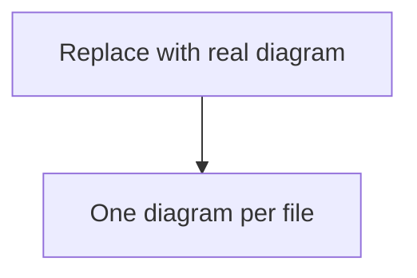

<!-- Architecture exists at every level. It shows the entities of the level
     below and how they relate — the context an interface is defined against. -->

<!-- diagram-type: component | sequence | state | deployment | use-case -->

| Field | Value |
|---|---|
| Purpose | |
| Scope | |
| Notes | |

