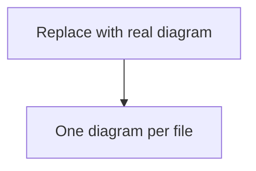

<!-- diagram-type: component | sequence | state | deployment | use-case -->

| Field | Value |
|---|---|
| Purpose | |
| Scope | |
| Notes | |

```mermaid
flowchart TD
  A[Replace with real diagram] --> B[One diagram per file]
```
